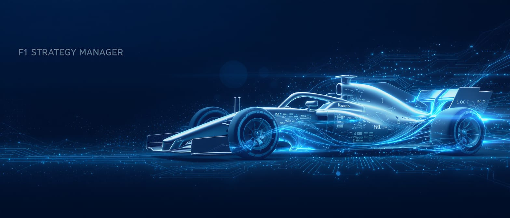

<div align="center">

# 🏎️ F1 Strategy Manager

</div>

<p align="center">
  
</p>

Revolutionizing strategic decision-making in Formula 1 through AI-powered models, computer vision, and expert systems. For a deeper insight, see the project's [paper here](documents/F1_Strategy_Manager_AI.pdf).

---

## 🚀 Project Overview

In Formula 1, strategic decisions must be made within seconds while considering complex, dynamic variables like weather, tire wear, track position, and fuel. The **F1 Strategy Manager** project proposes a solution by integrating advanced predictive models and expert systems to support real-time strategy recommendations.

---

## 🧠 Main Objective

Develop an **intelligent strategy recommender** that, based on processed race data, can offer optimized strategic decisions to the team in real time.

---

## 🧩 Project Structure

### 📦 Data Extraction & Preparation

- **Sources** : FastF1, OpenF1, Roboflow
- **Data Types** :
  - Weather data
  - Track and race conditions
  - Team radio communications
  - Video frames (used for computer vision models)
- **Augmentation & Labelling** :
  - Enhanced image dataset using flips, rotation, blur, etc.
  - Manual labelling of radios (sentiment, intent, NER)
- **Pipeline** :
  - All data merged into a single structured DataFrame
  - Generated synthetic variables and filtered irrelevant ones
  - Divided data by stint and lap sequences

### 🎯 Machine Learning Models

- **XGBoost** : Lap time prediction with MAE = 0.09s and RMSE = 0.15s
- **TCN (Temporal Convolutional Networks)** : For tire degradation modeling
- **YOLOv8** : Team identification from race footage with >90% mAP50
- **Whisper Turbo + BERT** : NLP pipeline for radio communication analysis

### 🧠 Expert System

- Developed using the **Experta** framework.
- Integrates all processed data and model results for strategy suggestion.

### 📊 App Interface

- Built using **Streamlit** .
- Allows:
  - Model interaction per section (Vision, NLP, ML)
  - Visual exploration and graphing
  - Chatbot Q&A via LLM for post-race reports and image analysis using Llama3.2-vision

---

## 🖥️ Environment Setup & Usage

### ⚙️ Requirements

- Python 3.10+
- CUDA-compatible GPU (for local training and video inference)
- Pipenv or venv (recommended)

### 📦 Main Libraries

```bash
pip install -r requirements.txt
```

If `requirements.txt` is not available, some key dependencies are:

- `pandas`, `numpy`, `matplotlib`, `seaborn`
- `fastf1`, `openf1`
- `opencv-python`, `roboflow`
- `torch`, `pytorch-lightning`, `xgboost`
- `transformers`, `whisper`, `experta`
- `streamlit`, `plotly`

### 🧪 Running the Project

1. Clone the repository:

```bash
git clone https://github.com/your-org/f1-strategy-manager.git
cd f1-strategy-manager
```

2. Activate your environment:

```bash
python -m venv venv
source venv/bin/activate  # On Windows use venv\Scripts\activate
```

3. Install dependencies:

```bash
pip install -r requirements.txt
```

4. Run the app:

```bash
streamlit run app/main.py
```

> Each major module (NLP, Vision, ML) is in its own subfolder with Jupyter notebooks and utility scripts.
