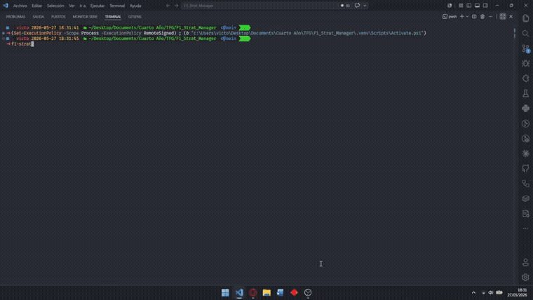
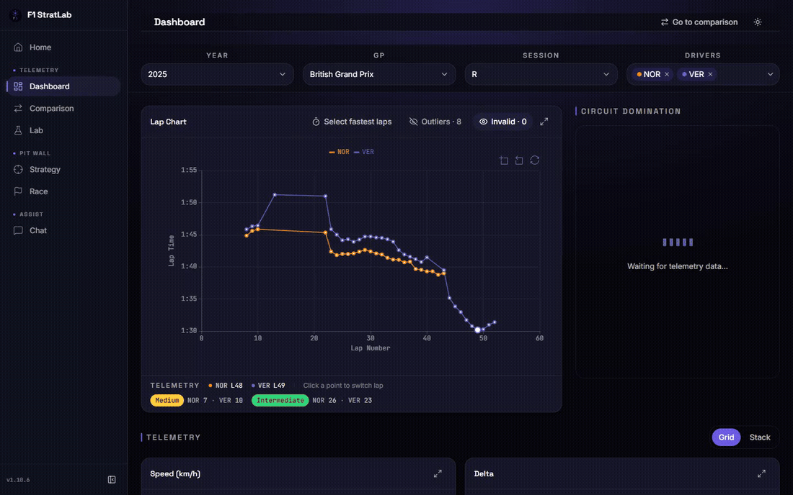

<div align="center">

# F1 StratLab

### *Race strategy, decided by six agents.*

[](LICENSE) [](https://www.python.org/) [](https://github.com/VforVitorio/F1-StratLab/releases) [](https://github.com/VforVitorio/F1-StratLab/actions/workflows/ci.yml) [](https://docs.f1stratlab.com/)

[](https://react.dev/) [](https://vite.dev/) [](https://pytorch.org/) [](https://github.com/theOehrly/Fast-F1) [](https://deepwiki.com/VforVitorio/F1-StratLab)

F1 StratLab is an open-source multi-agent AI platform for Formula 1 race replay and real-time strategy simulation. Replay a full race lap by lap in an interactive 2D interface and watch six specialised agents and an orchestrator work out an explainable strategy for every lap, covering tire wear, lap time, race situation, pit windows, team radio, and FIA regulations.

**Documentation: [https://docs.f1stratlab.com/](https://docs.f1stratlab.com/)**

[Landing page](https://vforvitorio.github.io/f1stratlab-web/) · [Full documentation](https://docs.f1stratlab.com/) · [DeepWiki](https://deepwiki.com/VforVitorio/F1-StratLab) · [Paper](documents/docs_legacy_strat_manager/F1_Strategy_Manager_AI.pdf) · [Hugging Face dataset](https://huggingface.co/datasets/VforVitorio/f1-strategy-dataset)

</div>

<div align="center">
  <a href="https://vforvitorio.github.io/f1stratlab-web/">
    
  </a>
</div>

<div align="center">
  <a href="docs/assets/demo/arcade-demo.mp4">
    
  </a>
</div>

<div align="center">
  <sub>▶ The <strong>Arcade</strong>: 2D race replay, strategy dashboard and live telemetry, all driven by one shared stream. <a href="docs/assets/demo/arcade-demo.mp4">Click for the full clip</a>, or see all three surfaces on the <a href="https://vforvitorio.github.io/f1stratlab-web/#demo-carousel">landing page</a>.</sub>
</div>

<div align="center">

🏆 **Final Degree Project, completed June 2026 · graded 10/10 with Distinction (Matrícula de Honor) · unanimously recommended by the tribunal for publication as a research article.**

[](https://github.com/VforVitorio/F1-StratLab/releases/latest)

</div>

---

## What it is

In Formula 1, strategic decisions must be made within seconds while juggling weather, tire wear, track position, and fuel. **F1 StratLab** packages a multi-agent AI system (six specialised agents coordinated by an orchestrator) plus a 2D race replay and a post-race analytics UI into a single repository. Data comes from FastF1 and OpenF1; models span XGBoost, TCN + MC Dropout, LightGBM, RoBERTa / SetFit / BERT-large, Whisper, and FIA RAG over Qdrant.

See [`ARCHITECTURE.md`](ARCHITECTURE.md) for the one-page topology and [`docs/`](docs/) for the deep dives.

## Features

- Lap-by-lap 2D race replay of a Grand Prix, in real time
- Six specialised strategy agents (pace, tire, race situation, pit, radio, regulations) plus a Monte Carlo orchestrator
- Explainable output: every recommendation exposes each agent's reasoning
- Team-radio transcription and NLP (Whisper, RoBERTa, SetFit, BERT-large)
- Retrieval over the FIA sporting regulations (Qdrant + BGE-M3)
- Live telemetry windows and post-race analytics
- Natural-language chat over a finished race
- Three ways to run it: CLI, Arcade, and the Web app (React SPA)

## Three surfaces, one codebase

| Surface                            | Command                                                                                                     | When to use                                                                                          |
| ---------------------------------- | ----------------------------------------------------------------------------------------------------------- | ---------------------------------------------------------------------------------------------------- |
| **CLI**                      | `f1-strat` (interactive wizard) · `f1-sim Melbourne VER "Red Bull Racing" --year 2025` (headless)                                                      | Headless Rich-based live inference panel for a single race. `f1-strat` opens an arrow-key menu (GP, driver, provider, head-to-head); `f1-sim` is the scripted form. |
| **Arcade** (primary live UI) | `f1-arcade --viewer --year 2025 --round 3 --driver VER --team "Red Bull Racing" --driver2 LEC --strategy` | Three-window 2D race replay + PySide6 strategy dashboard + live telemetry grid. No backend required. |
| **Web app** (post-race)    | `f1-webapp` (wraps `docker compose up`)                                                               | React SPA (Vite + TypeScript + Tailwind + ECharts): telemetry dashboard, 60fps driver comparison, ML model lab, multi-agent pit-wall strategy, race analysis, and a streaming AI chat that renders tool results inline. Backed by FastAPI. |

The Arcade is in the hero above. Here are the other two:

<table>
<tr>
<td width="50%" align="center">
  <a href="docs/assets/demo/cli-demo.mp4">
    
  </a>
  <br/>
  <sub><strong>CLI</strong>, headless Rich panel, one race, no GUI. <a href="docs/assets/demo/cli-demo.mp4">Play ▶</a></sub>
</td>
<td width="50%" align="center">
  <a href="docs/assets/demo/webapp-demo.mp4">
    
  </a>
  <br/>
  <sub><strong>Web app</strong>, post-race analytics and the AI strategist. <a href="docs/assets/demo/webapp-demo.mp4">Full ~30s tour ▶</a></sub>
</td>
</tr>
</table>

## How to run

**CLI**: install the wheel, then launch the interactive wizard (banner + arrow-key pickers):

```bash
uv tool install "git+https://github.com/VforVitorio/F1-StratLab.git"
f1-strat
```

For a scripted, no-menu run use `f1-sim <gp_name> <driver> <team> --year <yyyy>` instead.

**Arcade**: same install drops `f1-arcade` on PATH:

```bash
uv tool install "git+https://github.com/VforVitorio/F1-StratLab.git"
f1-arcade
```

**Web app**: clone **with the telemetry submodule**, add an env file, then bring the stack up with Docker (FastAPI + the React SPA):

```bash
git clone --recurse-submodules https://github.com/VforVitorio/F1-StratLab.git && cd F1-StratLab
cp .env.example .env          # add OPENAI_API_KEY, or set F1_LLM_PROVIDER=lmstudio
docker compose up
```

Requires Python 3.10-3.12 and an `OPENAI_API_KEY` (or `F1_LLM_PROVIDER=lmstudio`). Full options (pip fallback, local web-app dev server, data bootstrap) in [`INSTALL.md`](INSTALL.md).

## Project layout

- [`src/arcade/`](src/arcade/): 2D race replay (pyglet) + PySide6 strategy dashboard
- [`src/agents/`](src/agents/): multi-agent orchestrator (N25 → N31)
- [`src/simulation/`](src/simulation/): `RaceReplayEngine` + `RaceStateManager`
- [`src/telemetry/`](src/telemetry/): FastAPI backend + React web app (post-race UI, git submodule)
- [`src/nlp/`](src/nlp/): radio transcription + sentiment/intent/NER pipeline
- [`src/rag/`](src/rag/): Qdrant retriever over FIA sporting regulations
- [`src/f1_strat_manager/`](src/f1_strat_manager/): CLI infrastructure (data bootstrap, GP slug resolver)
- [`scripts/`](scripts/): CLI entry points and maintenance tools
- [`docs/`](docs/): architecture, API reference, arcade guides (the docs site source)
- [`documents/dev_docs/diagrams/`](documents/dev_docs/diagrams/): draw.io diagram sources

## Contributing

See [`CONTRIBUTING.md`](CONTRIBUTING.md) for dev setup, code-style rules, and the untouchable-files list. Bug reports, feature ideas, and data anomalies go through the templates under [.github/ISSUE_TEMPLATE/](.github/ISSUE_TEMPLATE/).

## Related

This project is part of a broader F1 AI suite:

- [F1 StratLab (this repo)](https://github.com/VforVitorio/F1-StratLab): strategy engine
- [F1 Telemetry Manager](https://github.com/VforVitorio/F1_Telemetry_Manager): FastAPI backend + React web app (post-race UI), vendored here under [`src/telemetry/`](src/telemetry/) as a git submodule
- [F1 AI Team Detection](https://github.com/VforVitorio/F1_AI_team_detection): YOLOv12 team identification from race footage
- [F1 Strategy Dataset (Hugging Face)](https://huggingface.co/datasets/VforVitorio/f1-strategy-dataset): trained weights and processed race data
- [Thesis + IEEE technical report](documents/thesis/): the full TFG memoria and IEEE report (deep methodology, metrics, design rationale)

## About

**Final Degree Project (Trabajo Fin de Grado)**, Fourth year, Grado en Ingeniería de Sistemas Inteligentes. Feedback, suggestions and contributions are welcome via the issue templates.

## Cite this work

If F1 StratLab is useful in your research, your writing or your own project, please cite it. GitHub's "Cite this repository" button reads the same [`CITATION.cff`](CITATION.cff), but here it is in full so it can be copied without leaving the page.

**BibTeX**

```bibtex
@software{vega_sobral_f1stratlab,
  author  = {Vega Sobral, V{\'i}ctor},
  title   = {{F1 StratLab}: an open multi-agent system for Formula 1 race strategy},
  year    = {2026},
  version = {2.0.1},
  url     = {https://github.com/VforVitorio/F1-StratLab},
  note    = {Documentation: https://docs.f1stratlab.com/}
}
```

**APA**

> Vega Sobral, V. (2026). *F1 StratLab: an open multi-agent system for Formula 1 race strategy* (Version 2.0.1) [Computer software]. https://github.com/VforVitorio/F1-StratLab

**Plain text**, a link is enough for a blog post or a talk:

> F1 StratLab by Víctor Vega Sobral, https://github.com/VforVitorio/F1-StratLab

If you build on a specific part, citing the version you used helps: the strategy engine changes between releases, so the numbers in a v1 run are not the numbers in a v2 one. And if you do use it for something, an issue or a message saying so is genuinely welcome, it is the only way to find out where this ends up.

---

> **Disclaimer: no copyright infringement intended.** Formula 1, F1, and related marks are trademarks of Formula One Licensing B.V. and are used here for reference only. All race data is sourced from public APIs (FastF1, OpenF1) and is used strictly for educational and non-commercial purposes. This project is not affiliated with, endorsed by, or in any way officially connected to Formula 1, the FIA, or any F1 team.
