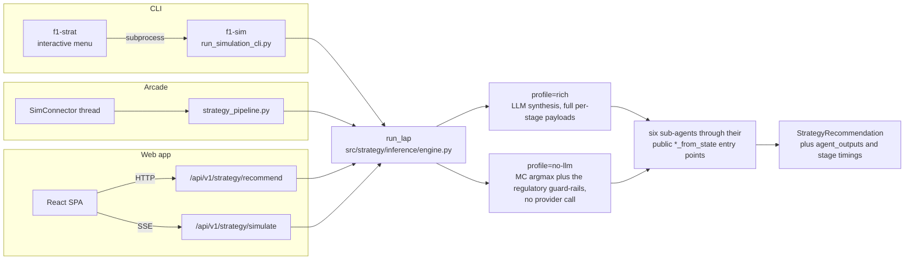

# Strategy Pipeline — the shared engine

`src/strategy/inference/engine.py::run_lap` is the single implementation of the N31 lap pipeline. The CLI, the arcade and the backend all route through it. This page covers what it returns, the two profiles, and why the arcade is now a nine-line delegate instead of a copy.

## One engine, three surfaces



The arrow that matters is the one that is missing: no surface has its own copy. **A strategy call in the web app is the same call the CLI would print for that lap.** If they ever disagree, that is a bug, not a difference of surface.

Every surface needs the same six sub-agents, the same MoE routing, the same Monte Carlo pass and the same synthesis. They differ only in what they render. So the pipeline lives in one place and the surfaces choose how much of its output to consume:

```
src/strategy/inference/engine.py
    run_lap(race_state, laps_df, lap_state=None, *, profile="rich",
            return_agent_outputs=True)
        -> tuple[StrategyRecommendation, dict | None, dict[str, float]]
```

- **`StrategyRecommendation`** — the synthesised decision (14 fields). What the CLI and the web app consume.
- **`agent_outputs`** — the raw per-sub-agent dataclasses, keyed `pace_out`, `tire_out`, `situation_out`, `radio_out`, `pit_out`, `regulation_context`, `rag`, `active`, `guardrail_reason`. What the arcade dashboard renders its cards and charts from.
- **stage timings** — per-stage seconds, for the surfaces that show them.

The sub-agents are imported through their public `*_from_state` entry points; the output dataclasses come from `src/agents/strategy_orchestrator.py`. Nothing about them is engine-specific.

## Profiles

| profile | what runs | use it for |
|---|---|---|
| `rich` | the full pipeline, including the LLM synthesis step | the default; reproduces `run_strategy_orchestrator_from_state` byte for byte |
| `no-llm` | everything except the LLM; the deterministic guardrails produce the decision | fast, offline, reproducible runs, and any path that must not spend tokens |

`rich` is guarded by parity tests against the orchestrator, so the two cannot drift apart silently.

## The arcade delegates

`src/arcade/strategy_pipeline.py::run_strategy_pipeline` keeps its old public signature so `src/arcade/strategy.py` and the dashboard formatters are untouched. Its body is one call:

```python
rec, agent_outputs, _timings = run_lap(race_state, laps_df, lap_state, profile="rich")
return rec, agent_outputs
```

The arcade needs the raw outputs and the CLI does not, but that is a difference in **consumption**, not in pipeline. `run_lap` returns both and each surface takes what it renders.

## Why this replaced a duplicate

This module used to be a body-copy of the orchestrator, and this page used to document a "how to stay in sync" ritual: open both files side by side and transcribe every edit by hand. That ritual was the bug. A copy kept in sync by discipline drifts the first time someone edits one file and not the other, and it did: an audit flagged it and the #166 crash proved it.

The lesson generalises beyond the arcade, and the strategy engine relearned it the hard way. `src/simulation/race_state_manager.py` had already solved a pile of race-data problems correctly (NaN never becomes a searchable number, gaps come from the elapsed-time column, retired cars fall out on their own). A second implementation was later written alongside it for the API path, and it reproduced every one of those bugs from scratch, silently, for months. Two implementations of the same idea do not stay equal because someone intends them to.

So: **before writing a second path that shapes race data, check whether a clean one already exists.** If it does, call it.

## SimConnector threading

The arcade strategy driver is `src/arcade/strategy.py::SimConnector`. It is a plain Python class, not a Qt object, spawned as a `threading.Thread` from `F1ArcadeView._init_strategy_layer`.

- Owns a `StrategyState` dataclass caching the latest `LapDecision`, the per-agent outputs and playback metadata, behind a `threading.Lock`.
- Owns the background thread that iterates `RaceReplayEngine.replay()` and calls `run_strategy_pipeline(race_state, laps_df, lap_state=None)` per lap.
- Emits `StartEventDTO` once on the first frame, then `LapDecisionDTO` per lap.

## Why not SSE from the backend

The arcade used to subscribe to `GET /api/v1/strategy/simulate/stream`. Phase 3.5 replaced it with the direct in-process loop:

- **No extra process.** Strategy mode no longer needs `uvicorn` running first.
- **No SSE client.** The arcade's consumer was a hand-rolled parser over `httpx.stream` with its own reconnect logic. A thread is simpler.
- **Standalone.** The arcade ships without a FastAPI dependency.

The backend SSE endpoint is still live and smoke-tested; the arcade just does not consume it.

## Smoke test

```bash
# CLI path
python scripts/run_simulation_cli.py Melbourne VER "Red Bull Racing" --no-llm

# Arcade path
python -m src.arcade.main --viewer --year 2025 --round 3 --driver VER --team "Red Bull Racing" --strategy
```

Both should reach lap 2 without tracebacks.
