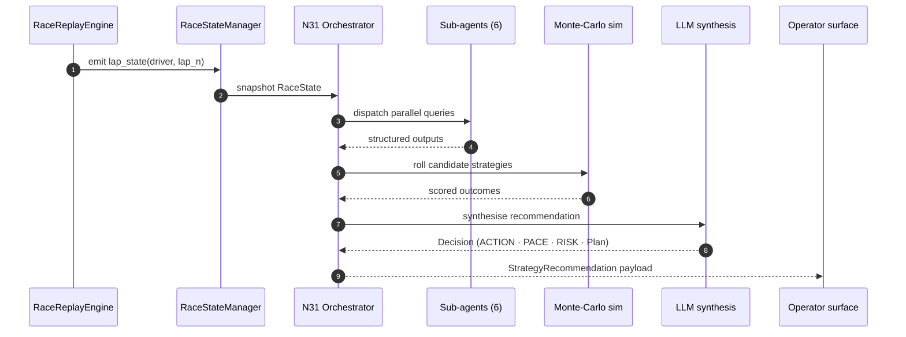

# How F1 StratLab is wired

> An end-to-end tour of the codebase: how a single lap-tick travels from the replay engine through the six sub-agents, into the N31 orchestrator and out to the operator surfaces. Use this page as the entry point, then drill into the deeper references below.

## One lap, end to end

The diagram below traces the lifecycle of a single lap. Every component is reified in `src/` — the names match the production modules so you can grep your way from this page into the source.

The same loop runs in three places: the CLI consumes it in batch, the Arcade renders it in a PySide6 dashboard, and the web app surfaces it in its strategy and chat tabs.

## Where to go next

Six layers, six pages — each linked from the agent graph and from this page.

- **[Multi-agent system](#/multi-agent)** — N25–N31 architecture: agents, MoE routing, Monte-Carlo simulation, LLM synthesis.
- **[Simulation engine](#/simulation)** — `RaceReplayEngine`, `RaceStateManager`, the `lap_state` schema every layer agrees on.
- **[Agents API reference](#/agents-api)** — per-agent input / output schemas, model artefacts and entry-point signatures.
- **[Backend API](#/backend-api)** — FastAPI routers, the SSE simulation endpoint, the contract the web app and the Arcade speak.
- **[Streamlit frontend (legacy)](#/streamlit)** — walkthrough of the retired Streamlit app, kept for historical reference.
- **[Arcade dashboard](#/arcade-quick-start)** — three independent windows coordinated by a single Python process.

> **Looking for a specific file?** The narratives on this site stop at the contract level. For per-file deep-dives — every function in `src/agents/`, every notebook from N06 to N34, every helper in `src/arcade/` — jump to the [F1 StratLab DeepWiki](https://deepwiki.com/VforVitorio/F1-StratLab). It is regenerated on every push to `main`.

## Key data contracts

Three structures cross every boundary in the system. If you remember nothing else, remember these.

### `lap_state`

The atomic payload the simulation engine emits per driver per lap. It carries the bare-minimum slice of telemetry the agents need: current lap number, compound and tire age, current and previous lap times, absolute sector times, gap to leader and per-rival intervals, in-lap and out-lap flags, the Art. 30.5(m) stint history for our driver and every rival (stops made, compounds used, whether the mandatory two-compound stop is still pending), and the active race-control state. Every downstream agent treats `lap_state` as immutable; mutations happen in the orchestrator's state machine, not inside the agents.

### `RaceState`

A thin, per-lap Pydantic model (`src/agents/strategy_orchestrator.py`) that carries the single-driver context N31 needs for one decision: driver code, lap, total laps, position, compound, tyre age, gap/pace deltas versus the car ahead, weather, radio/RCM windows, and the risk-tolerance dial. It is **not** a cumulative session object — there is exactly one `RaceState` class in the codebase, and it holds no stint history, pit log, or field-wide tire roster. The field-wide picture (every driver's stints, pit stops, and current tyre) lives in the `laps_df` DataFrame the orchestrator and agents load once per session, plus the `rivals` list inside each `lap_state` tick — see [Race replay engine](#/simulation) for that schema. The orchestrator builds a fresh `RaceState` per lap so every sub-agent decision is grounded in the same snapshot, regardless of how fast each agent responds.

### `StrategyRecommendation`

The structured output the orchestrator emits per decision tick (called `StrategyState` on the wire protocol some surfaces consume, but the Pydantic type is `StrategyRecommendation`). Fourteen fields are frozen by schema: the primary `action` plus pit-execution detail (`pit_lap_target`, `compound_next`, `undercut_target`), driver-side instructions (`pace_mode`, `target_lap_time_s`, `risk_posture`), multi-lap planning (`contingencies`, `key_risks`, `expected_stint_end`), and post-hoc grounding attached in code (`scenario_scores`, `regulation_context`) around the LLM's own `reasoning` and `confidence`. See [Agents API reference](#/agents-api) for the full field-by-field table. `StrategyRecommendation` is what the CLI prints, the Arcade renders and the web app chat surfaces.

## How the pieces ship

Three independent release tracks ship the system so that consumers can pick the surface that fits their workflow:

- **R1 — CLI wheel.** `uv tool install` straight from the GitHub release. Headless, batchable, no GPU needed for the inference path.
- **R2 — Arcade.** The three-window PySide6 + pyglet experience. Same wheel, but the `f1-arcade` entry point boots the GUI and spawns the strategy subprocess locally.
- **R3 — Backend + web app.** The FastAPI server (SSE simulator, MCP tools) plus the React SPA. The docker-compose recipe ships the whole stack; `f1-webapp` launches it.

See [Setup and deployment](#/setup) for the full install matrix per surface and platform.
