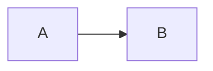

# Documentation maintenance

How this documentation site is built, deployed and extended. Read this before adding new pages, changing the theme or pointing the site at a custom domain.

## Stack overview

| Component | Tool | Lives in |
|---|---|---|
| App framework | React (UMD, no build step) | `docs/index.html` (CDN script tag) |
| App scripts | Plain `React.createElement` JS | `docs/app/*.js` |
| Markdown rendering | [`marked`](https://marked.js.org/) | `docs/index.html` (CDN script tag) |
| Syntax highlighting | [Prism](https://prismjs.com/) | `docs/index.html` (CDN script tag) |
| Diagrams | [Mermaid](https://mermaid.js.org/) | `docs/index.html` (CDN script tag) |
| Page content | Markdown | `docs/pages/*.md` |
| Page registry | `window.PAGES` array | `docs/app/nav.js` |
| Styles | CSS custom properties | `docs/styles/tokens.css`, `docs/styles/docs.css` |
| Deploy workflow | GitHub Actions | `.github/workflows/docs.yml` |
| Hosting | GitHub Pages (`gh-pages` branch) | repo Settings -> Pages |

The scripts load in dependency order: `nav.js`, `markdown.js`, `components.js`, `graph.js`, `home.js`, `main.js`. There is no bundler, no transpiler, no build step at author time.

The brand palette and typography are kept aligned with the public landing at [f1stratlab.com](https://f1stratlab.com/) by mirroring the design tokens declared in `colors_and_type.css` (the landing repo) into `docs/styles/tokens.css`.

## Local preview

No build step needed. Serve the `docs/` directory with any static HTTP server:

```bash
# from the repo root
python -m http.server 8000 --directory docs
```

Then open `http://localhost:8000/`. Edit any `.md` file or `.js` script and refresh the browser. The app fetches page content on demand, so a plain refresh picks up markdown edits instantly; a script change requires a hard reload (`Ctrl+Shift+R`) to bypass the browser cache.

## Adding a new page

1. Create `docs/pages/<slug>.md` with the page content.
2. Open `docs/app/nav.js` and add an entry to `window.PAGES`:

```js
{
  slug: "your-slug",
  title: "Page title",
  section: "Architecture",       // must be one of window.SECTIONS
  file: "pages/your-slug.md",
  description: "One-line description for search and graph tooltips.",
  eyebrow: "Short label",        // shown above the title in the page header
  tags: ["agents", "api"],       // existing tags only, or declare new ones in TAG_LABELS
},
```

3. If the page uses a tag not already in `window.TAG_LABELS`, add it there too.
4. After editing any `docs/app/*.js` file, bump its `?v=` cache-buster in `docs/index.html` so browsers pick up the change (e.g. `main.js?v=4` -> `main.js?v=5`).
5. Push to `main`. The deploy workflow runs automatically.

### Creating a new section

Add the section name to `window.SECTIONS` in `nav.js` (order matters -- it controls sidebar ordering) and add a colour entry in `window.SECTION_COLORS`. Then set `section` on the new page entry to match the new name exactly.

## Theme and palette

Styles live in `docs/styles/tokens.css` (CSS custom properties) and `docs/styles/docs.css` (component rules). The token file references the same property names the landing site uses (`--purple-600`, `--purple-300`, `--bg-0` and friends).

A change to colours or fonts must update **both** repos:

- This docs site: `docs/styles/tokens.css`
- Public landing: `f1stratlab-web/colors_and_type.css`

## Deployment

### Automatic on push to `main`

`.github/workflows/docs.yml` watches:

- `docs/**`
- `scripts/prerender_docs.mjs`
- `.github/workflows/docs.yml`

When any of these change on `main`, the workflow:

1. Checks out the repo.
2. Installs Node dependencies (`npm install marked`).
3. Stages `docs/` into `_site/`.
4. Runs `node scripts/prerender_docs.mjs docs _site`, which renders each `docs/pages/*.md` to a crawlable `/<slug>/index.html` and also generates `sitemap.xml`, `llms-full.txt` and `404.html`.
5. Replaces the `__DOCS_VERSION__` placeholder in the staged files with the current version from `pyproject.toml`.
6. Publishes `_site/` to the `gh-pages` branch via `peaceiris/actions-gh-pages@v4`.

GitHub Pages picks up the new `gh-pages` commit and republishes the site, usually within 60 seconds.

### Manual trigger

```bash
gh workflow run docs.yml --ref main
```

## Custom domain

The site is served from the `gh-pages` branch at the custom domain `https://docs.f1stratlab.com/` via a `CNAME` file at the root of that branch (committed as `docs/CNAME`). DNS is a `CNAME` record: host `docs`, value `vforvitorio.github.io`.

To change the domain:

1. Update the `docs/CNAME` file with the new hostname.
2. Update the DNS record accordingly.
3. Confirm in repo Settings -> Pages -> Custom domain.

## Diagrams

Mermaid loads from CDN and is activated by `docs/app/markdown.js`. Write diagrams as fenced code blocks tagged `mermaid`:

````

````

For more complex diagrams (Mermaid fenced blocks inside the page markdown (there is no `docs/diagrams/`; the draw.io sources live in `documents/dev_docs/diagrams/` in the repo, not on the site)), export as SVG or PNG from [diagrams.net](https://app.diagrams.net/) and embed the image in the markdown.

## Where to change if X

| Desired change | File(s) to edit |
|---|---|
| Add a new docs page | `docs/pages/<slug>.md` + `window.PAGES` entry in `docs/app/nav.js` |
| Edit the nav order or sections | `window.PAGES` / `window.SECTIONS` in `docs/app/nav.js` |
| Change colours or fonts | `docs/styles/tokens.css` (and mirror to `f1stratlab-web/colors_and_type.css`) |
| Change the home page layout | `docs/app/home.js` + `docs/styles/docs.css` |
| Change how markdown is rendered | `docs/app/markdown.js` |
| Change the knowledge graph | `docs/app/graph.js` |
| Add a new tag | `window.TAG_LABELS` in `docs/app/nav.js` + the page's `tags` array |
| Change the deploy flow | `.github/workflows/docs.yml` + `scripts/prerender_docs.mjs` |
| Change the CDN library versions | `<script>` tags in `docs/index.html`; bump `?v=` on the app scripts too |

## Troubleshooting

| Symptom | Likely cause | Fix |
|---|---|---|
| Page shows "not found" | Slug missing from `window.PAGES` or filename typo | Check `nav.js` entry and `docs/pages/` filename match |
| Script changes not reflected | Browser cached old JS | Hard reload (`Ctrl+Shift+R`) |
| `gh-pages` push 403 | Workflow permissions too low | Settings -> Actions -> Workflow permissions -> "Read and write" |
| Custom domain says "DNS check unsuccessful" | DNS not propagated | Wait 10-30 min |
| Mermaid diagram not rendering | Fenced block not tagged `mermaid` or Mermaid not yet loaded | Check the code fence tag; mermaid.initialize runs after DOMContentLoaded |
| Prerender step fails locally | `marked` not installed | Run `npm install marked` before running `prerender_docs.mjs` |
