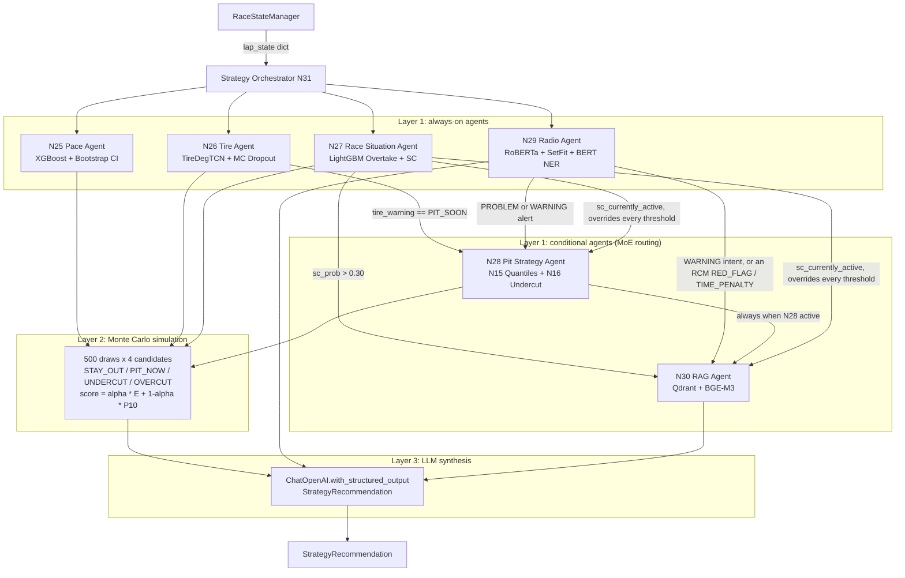
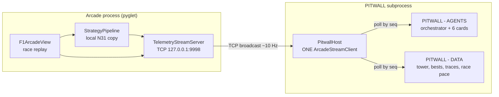
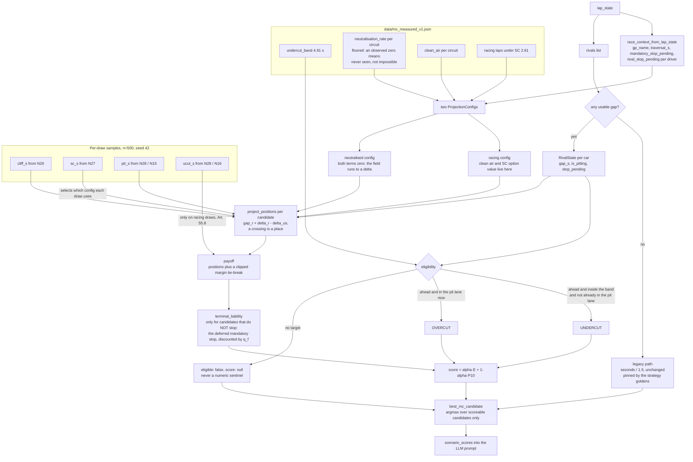

# Multi-Agent Strategy Architecture (N25-N31)

**The F1 StratLab multi-agent system is a LangGraph pipeline of six sub-agents (N25-N30) and one orchestrator (N31) that turns a per-lap `lap_state` into a typed `StrategyRecommendation`**, fusing ML model inference, Monte Carlo simulation and LLM synthesis across three layers.

## Purpose

The multi-agent system replaces the legacy Experta rule engine (`base_agent.py`, `strategy_agent.py`) with a LangGraph-based pipeline that combines ML model inference, Monte Carlo simulation, and LLM-driven synthesis to produce race strategy recommendations.

## System overview



**Routing rules (text equivalent of the diagram above):**

- The orchestrator always runs the four always-on agents: N25 Pace, N26 Tire, N27 Race Situation and N29 Radio.
- N28 Pit Strategy activates when N26 reports `tire_warning == PIT_SOON`, when N29 raises a PROBLEM or WARNING alert, or when N27 reports an active Safety Car.
- N30 RAG activates when N27 reports `sc_prob > 0.30`, when N28 is active, or under an active Safety Car.
- Monte Carlo then draws 500 samples over four candidates (STAY_OUT, PIT_NOW, UNDERCUT, OVERCUT), scoring `score = α·E + (1−α)·P10`, and the LLM synthesises the final `StrategyRecommendation`. Since the projection redesign the score is measured in **projected track position**, not in seconds, see [What the Monte Carlo actually scores](#/multi-agent) below.

## Three-window arcade

Since Phase 3.5 Proceso B (April 2026), the `python -m src.arcade.main ... --strategy` launcher runs several windows driven by one shared telemetry stream. The two follower windows were a PySide6 pair until it was retired; they are the PITWALL pair now, documented in [PITWALL windows](#/pitwall). The layout is:



Four properties are load-bearing:

1. **The arcade owns the `TelemetryStreamServer`.** `src/arcade/stream.py` exposes the merged arcade + strategy snapshot; every other window is a subscriber, never the source of truth.
2. **One subprocess hosts both windows.** The arcade spawns a single `subprocess.Popen`. Two windows in one process is cheaper than two, and it is what lets them share a single stream reader.
3. **The two windows share ONE stream reader.** `PitwallHost` owns a single `ArcadeStreamClient` and both windows poll it by sequence number, so they cannot disagree about which frame they are showing - a blind latest-payload slot had them differing on 58% of polls. Closing one window only decrements a count; it does not blind the other.
4. **Arcade runs the strategy pipeline in-process.** `src/arcade/strategy_pipeline.py` delegates to the shared engine (`src/strategy/inference/engine.py::run_lap`), so the arcade does not depend on the FastAPI backend at runtime and does not carry its own copy of the orchestrator. It used to; that copy drifted and crashed (#166), which is why the engine exists.

See [Arcade strategy pipeline](#/arcade-strategy-pipeline) for the shared engine and its profiles, and [PITWALL windows](#/pitwall) for the follower architecture.

## Agent details

### N25: Pace Agent (`pace_agent.py`)

Wraps the N06 XGBoost delta-lap-time model. Returns predicted lap time, delta signals against previous lap and session median, and bootstrap confidence intervals (N=200 draws with 2% Gaussian noise on continuous features).

- **Model**: XGBoost fitted on 2023-2024 lap data, with **2025 held out**. This line used to read "2023-2025", which folded the test season into the training set: the feature manifest's own row counts are 22,106 train and 23,256 validation, exactly the 2023 and 2024 featured parquets, and every operating bound below is measured on those two seasons for the same reason.
- **Output**: `PaceOutput` (lap_time_pred, delta_vs_prev, delta_vs_median, ci_p10, ci_p90)
- **Circuit feature**: `mean_sector_speed` is a property of the track, one value per GP, looked up from the featured parquet. A bug substituted the speed trap reading on every call through the `RaceStateManager` path instead; see the operating-envelope section under N28 for how that surfaced.
- **No LLM step**: unlike its tire/pit/race-situation siblings below, pace calls the XGBoost model directly: `reasoning` is a deterministic f-string, not LLM output. Pace is the one always-on agent with no qualitative judgment to make (no `warning_level`/`action`/`threat_level` category alongside its numbers), so a `pace_agent.py` once carried a complete but never-wired LangGraph ReAct scaffold; it was formally retired in #781 after the #778/#779/#780 archaeology and decision. See [agents-api.md](#/agents-api) for the full record.

### N26: Tire Agent (`tire_agent.py`)

Wraps per-compound TireDegTCN models (N09/N10) with MC Dropout inference. Answers: how many laps remain before the degradation cliff?

- **Model**: Causal TCN per compound + Platt calibration
- **Output**: `TireOutput` (laps_to_cliff_p10/p50/p90, warning_level, deg_rate)
- **Warning levels**: OK, MONITOR, PIT_SOON (derived from `laps_to_cliff_p10` against circuit-cluster-aware thresholds; there is no CRITICAL level)

### N27: Race Situation Agent (`race_situation_agent.py`)

Combines N12 (overtake probability via LightGBM) and N14 (safety car probability via LightGBM) into a single threat assessment per lap.

- **Models**: LightGBM overtake (AUC-PR 0.5491) + LightGBM SC (AUC-PR 0.0723)
- **Output**: `RaceSituationOutput` (overtake_prob, sc_prob_3lap, threat_level, **sc_currently_active**, **vsc_active**)

#### RCM Safety Car override

The N14 LightGBM was trained to predict a *future* SC, not to recognise one already deployed. To close that gap, N27 inspects the lap's `rcm_events` (forwarded by the orchestrator from `RadioPipelineRunner`) and, when any event matches `SAFETY_CAR_DEPLOYED` or `VIRTUAL_SAFETY_CAR_DEPLOYED`, forces `sc_prob_3lap = 1.0`, sets `sc_currently_active = True`, and elevates `threat_level` to `HIGH`. Release events (`SAFETY_CAR_ENDING`, `SAFETY_CAR_IN_PIT_LANE`, `VIRTUAL_SAFETY_CAR_ENDING`) take priority in the same window so the override clears as soon as the neutralisation ends. The override is logged in the `reasoning` field with an `[RCM OVERRIDE: ...]` prefix so the audit trail survives the chat / arcade summary path.

`sc_currently_active` is deliberately a single back-compat flag: true under **either** a full Safety Car (Art. 55) or a Virtual Safety Car (Art. 56). A second field, `vsc_active`, records whether the specific neutralisation is a VSC, a full SC and a VSC differ in the pit-time saving they offer, so the Monte Carlo and the N28 prompt need to tell them apart (#471), which the single flag could not. `sc_active` (a derived property, not stored) is true only for a full SC: `sc_currently_active and not vsc_active`.

### N28: Pit Strategy Agent (`pit_strategy_agent.py`)

Wraps N15 (physical pit stop duration P05/P50/P95 via HistGBT) and N16 (undercut success probability via LightGBM). Recommends when to pit, what compound to fit, and whether to undercut.

- **Models**: HistGBT quantile pit duration + LightGBM undercut
- **Output**: `PitStrategyOutput` (action, compound_recommendation, stop_duration_p05/p50/p95, undercut_prob, sc_reactive)
- **Activation**: conditional, runs when tire_warning is PIT_SOON, radio flags PROBLEM/WARNING, **or N27 reports `sc_currently_active = True`** (the RCM-override path)

#### Honoring an active Safety Car

**A rail encodes what the regulation makes certain. It never encodes a strategy opinion.** Facts are forced; the stop/stay call stays with the model, which is the only layer that sees the state the decision depends on.

When `sc_currently_active = True`, N28's prompt swaps the "SC probability" line for an explicit `SC STATUS: SAFETY CAR DEPLOYED RIGHT NOW` banner and waives the `MINIMUM STINT LENGTH` constraint: a stop under an SC is far cheaper, because the field is delta-limited and queued, so the *relative* loss shrinks. That makes pitting cheaper. It does not make it correct, and nothing forces it.

What is forced are the rules:

| Fact | Regulation | Value | Where |
|---|---|---|---|
| No overtaking on track | **Art. 55.8** (SC) / **56.6** (VSC) | `overtake_prob = 0` | N27 |
| An SC is deployed | Art. 55.4 | `sc_prob_3lap = 1.0` | N27 |
| DRS unavailable | **Art. 22.1(c)** | `drs_window = 0` | N27, feature build |
| No green-flag lap-time target | **Art. 55.7** | `target_lap_time_s = None` | final assembly |

`overtake_prob = 0` is not an approximation. N12 models a *racing* overtake; of the eight exceptions in Art. 55.8, only "a car slows with an obvious problem" yields a real position gain, and N12 has no feature for it. Every input it does use is regulation-corrupted: DRS is off, the gap compresses toward ten car lengths (55.7/55.10), and `pace_delta` collapses to the FIA ECU delta. Under an SC the model is not imprecise, it is **inapplicable**.

`target_lap_time_s` is the subtle one. It is grounded in N06's **green-flag** pace, and Art. 55.7 requires drivers to stay **above** the FIA ECU minimum time: shipping it instructs the driver to earn a penalty. The real delta cannot be sourced, so the field has no valid value. `None` is forced by **absence of a source**, which is the test that separates a fact from an opinion.

##### Why the old rail was removed

This page used to document a rail that flipped any `STAY_OUT` to `PIT_NOW` under an SC, "replicating the McLaren Catar 2025 V7 fix". That is one race generalised into a universal law, and Art. 55.17 makes it provably wrong: if the SC is still out at the start of the last lap, the race **finishes behind it with no overtaking**, so track position surrendered to a late stop is unrecoverable by regulation. The pipeline could emit `action=PIT_NOW` carrying the reason *"too late to pit"*, because the rail overrode a correct guard-rail that already knew this.

It also silenced the computation built to weigh it: with an SC deployed `sc_prob_3lap` is 1.0, so **every** Monte Carlo draw already receives the full `SC_PIT_BONUS`. A `STAY_OUT` argmax under those conditions *is* the model saying the cheap stop was outweighed.

Staying out under an SC is right whenever a stop has already been made, the car leads a pack that must stop anyway, pitting now would rejoin into traffic, or the race is ending. Boxing is right when a stop is unavoidable regardless, the tyres are near the cliff, or the two-compound rule is unsatisfied and time is short. Not one of those is a rule. All of them are race state the model is given, and a rail sees none of it.

See `tests/mc/test_sc_regulatory_rails.py`.

##### The bounds that stayed, and the test they have to pass

Removing that rail did not remove the pit bounds, because they are a different kind of object and are judged differently.

| | What it does | What justifies it |
|---|---|---|
| **Prescriptive** rail | Makes the strategic decision *for* the model | A regulation, or nothing |
| **Proscriptive** bound | Forbids an action so a generative model cannot emit nonsense | **Calibration** |

Bounding an LLM's output space is legitimate engineering with or without an FIA article: the bounds exist so nothing can recommend a lap-2 stop because it felt like one. But a bound only earns that description if it sits where real strategy essentially never goes. The rule the project holds them to is explicit: **a bound may veto at most 5% of real green-flag stints**, measured over **1,852 of them across the 70 races of 2023-2025**.

Re-measured on the corrected dataset, **all four bounds now clear that ceiling**: SOFT vetoes 3.4%, MEDIUM 4.6%, HARD 4.9%, and the INTERMEDIATE/WET fallback 4.5%. The bound family that prompted the rule now satisfies it.

Checked against that rule, three of the four minimum-stint bounds were separating *unusual* from *usual* rather than *absurd* from *sane*, and were reset to the largest value that clears the ceiling:

| Bound | Was | Vetoed | Now | Vetoes |
|---|---|---|---|---|
| Minimum stint, SOFT | 8 laps | 15.5% | **2** | 3.4% |
| Minimum stint, MEDIUM | 12 laps | 17.0% | **7** | 4.6% |
| Minimum stint, HARD | 15 laps | 12.2% | **8** | 4.9% |
| Minimum stint, wet fallback | 10 laps | 20.0% | **6** | 4.5% |
| No pit before lap 5 | 5 | 2.21% | unchanged | 2.21% |
| No pit in the last 3 laps | 3 | 1.37% | unchanged | 1.37% |

The end-of-race bound is the only one that is partly a *fact*: under a Safety Car, Art. 55.17 ends the race behind it if it is still deployed on the final lap, so the position a late stop surrenders is unrecoverable by regulation rather than merely expensive. That article does not reach a green-flag lap, where the bound rests on the stop cost and on the measurement above.

The compounding effect is what made the old values worth changing rather than merely wrong. A stop inside a bound can never be agreed with, so it is excluded from the decision-agreement measurement: the bound was removing its own hardest cases from the evidence about itself.

Measured as a **single-variable comparison**: both columns run on the product's real race state, so only the bounds differ:

| decision-agreement tier, the retired six-race 2025 subset, 178 eligible stops | old bounds (8 / 12 / 15, wet 10) | shipped bounds (2 / 7 / 8, wet 6) |
|---|---|---|
| `min_stint` exclusion bucket | 17 stops | **5** |
| scored sample | 54 | **66** |
| exact lap | 25.9% | 21.2% |
| within one lap | 40.7% | 37.9% |
| within two laps | 46.3% | **51.5%** |
| mean signed error | -2.20 laps | -1.97 |

Both columns are the six races the tier sampled when the comparison was made, so the shipped-bounds column is not the system's current rate. On the whole 2025 season, 573 eligible stops, the shipped bounds score 204, exact 18.6%, within one 34.3%, within two 50.0%, mean signed -2.21 laps. `documents/eval_reports/decision_modes.md` is the current artefact. The table survives its own sample because comparing two sets of constants needs both arms measured on one sample, and only the shipped arm was re-run wider.

**The recalibration buys sample, not accuracy, and the honest reading is that the twelve stops it admits are harder than the ones already there.** Exact and within-one fall; within-two and the mean error improve. A bound that excludes a case is not scoring it well, it is refusing to be graded on it, so a lower rate over a wider sample is the more informative number, though calling that an accuracy improvement would be the same flattery the bound itself was performing.

> **The levels above are the 2026-08-06 re-measurement, and everything published before that date is retired.** The old harness built its own `RaceState` instead of the product's, and three of its inputs diverged: the gap to the car ahead was a flat 2.0 s on every lap because the key it read does not exist in the lap state, the pace delta was hardcoded to 0.0, and `rainfall` took the model default `False` through a wet Silverstone. All three feed the overtake model, the prompt, or the Monte Carlo the tier grades. On the identical sample with the real inputs (#829), **exact drops 31.3% to 21.2%, within one 47.8% to 37.9%, within two 61.2% to 51.5%**, and declines fall from 78 stops to 72.
>
> The table above is deliberately **not** that comparison. It used to read "54 to 66", pairing a pre-#829 number with a post-#829 one, so two variables moved inside the one sentence written to attribute an effect to the bounds. Both of its columns are now measured on the fixed inputs; only the constants differ. The `min_stint` and scored counts happen to be identical either way (17 and 54 under the old bounds, with or without the input fix), which is why the arithmetic half of the old claim survived, but that was luck, not the argument.
>
> Read them as the **deterministic** layer, `profile="no-llm"`: the Monte Carlo plus the guard rails, with the LLM synthesis off. Twelve of the fourteen recommendation fields the multi-agent system emits are written by the LLM, so this is not a measurement of the system this page describes end to end.

`documents/eval_reports/stint_lengths.md` regenerates these shares from the live constants on every run, so the report always grades what is actually shipping rather than what was shipping when it was written.

##### Operating envelopes: knowing when a model is answering outside what it learned

A separate contract, and a quieter one. None of the models refuse out-of-range input; they answer with the same confidence whether the call falls inside what they were trained on or not. N26's tire TCN did exactly that for two years.

An `OperatingEnvelope` (`src/strategy/inference/envelope.py`) names the input range a model's answer is actually valid over, and **labels only**: checking a feature vector never clips, alters or refuses a prediction, it only tells the call site whether to trust the one it already has. A feature that is absent is tracked as *unknown* rather than compared, because *unknown* must never collapse into a number a real reading could also take.

Two are declared today:

- **N15** (pit duration) declares the 50-lap tyre-life ceiling it was trained under. The clip that keeps it inside that range is unchanged; what the envelope adds is that hitting it stops being silent.
- **N06** (lap time) declares eleven feature ranges measured from its own training seasons. It has no clip at all, so the label is the entire mechanism.

The envelope earns its keep by what it surfaced rather than by what it prevents. Wiring it to N06 exposed that `mean_sector_speed` was carrying the **speed trap** on every real call, because the agent substituted `prev_speed_st` whenever no mean sector speed was supplied and nothing ever supplied one. Those are different physical quantities, 256.8 against 303.0 km/h on average, and the model had been reading the wrong one throughout. The value is a property of the circuit and was on disk all along; it is now looked up per GP, and a circuit that does not resolve reaches the model as missing rather than as a substituted reading.

It also surfaced something not yet fixed: N06 is asked to predict on the opening laps of a race and on the first lap of every stint, and it was never trained on either, because its own feature pipeline drops exactly those rows.

### N29: Radio Agent (`radio_agent.py`)

Two-stream NLP pipeline. Driver radio goes through RoBERTa-base sentiment, SetFit intent classification, and BERT-large NER. Race Control Messages go through a deterministic rule-based parser. Alerts are built deterministically from NLP is_alert flags, the LLM cannot miss or hallucinate alerts.

- **Models**: RoBERTa-base, SetFit, BERT-large-conll03 (radio); rule parser (RCM)
- **Output**: `RadioOutput` (radio_events, rcm_events, alerts, corrections)

### N30: RAG Agent (`rag_agent.py`)

Answers regulation questions by retrieving relevant FIA Sporting Regulation passages from a local Qdrant vector store (built by `scripts/build_rag_index.py`), using BGE-M3 embeddings and a LangGraph ReAct agent.

- **Retriever**: Qdrant + BGE-M3 embeddings
- **Output**: `RegulationContext` (answer, articles, chunks)
- **Activation**: conditional, only runs when sc_prob > 0.30, N28 is active, **or N27 reports `sc_currently_active = True`** (so the orchestrator pulls the SC pit-lane regulation snippet into the recommendation context)

### N31: Strategy Orchestrator (`strategy_orchestrator.py`)

Three-layer pipeline:

1. **MoE Routing**: deterministic if-else rules decide which conditional agents (N28, N30) to activate based on always-on agent outputs.
2. **Monte Carlo Simulation**: draws 500 samples from sub-agent probability distributions and evaluates four strategy candidates (STAY_OUT, PIT_NOW, UNDERCUT, OVERCUT). Score = alpha * E[S] + (1-alpha) * P10[S], where S is a **projected track position** (see below).
3. **LLM Synthesis**: structured-output LLM aggregates all reasoning strings and MC scores into a `StrategyRecommendation`.

- **Output**: `StrategyRecommendation` (action, reasoning, confidence, scenario_scores, contingencies)
- **Action values**: STAY_OUT, PIT_NOW, UNDERCUT, OVERCUT, ALERT
- **Pace modes**: PUSH, NEUTRAL, MANAGE, LIFT_AND_COAST
- **Risk levels**: AGGRESSIVE, BALANCED, DEFENSIVE

## What the Monte Carlo actually scores



Four things in that graph are the whole redesign. Eligibility can return **no number at all** rather than a sentinel. The measured tables enter as *configuration*, not as constants in the code. Each draw picks a racing or a neutralised config, which is what makes the Art. 55.17 endgame arithmetic rather than a rule. And the terminal liability applies only to the candidates that do not stop, because a deferred obligation is a cost only while it is still owed.

The layer used to score in generic seconds divided by a flat 1.5 s/position, over a sampled state that contained **no cars at all**. That constant cannot be right in both regimes: measured across 70 races, the median gap between consecutive cars is **2.23 s while racing and 1.48 s under a Safety Car**, so a single figure was a bunched-field number applied to green-flag racing. And losing 20 s costs zero positions with a 25 s cushion behind but three positions with cars at +2 / +8 / +15 s, a difference only a model that knows *which cars are where* can see.

Scoring now runs on a per-rival gap projection (`src/agents/position_projection.py`). Each candidate moves every gap by the difference between what a rival loses and what we lose; a gap crossing zero is a car changing sides, so counting the cars projected ahead gives the position directly. Three behaviours that used to need special cases now fall out of that arithmetic:

- **Rejoining into traffic** is automatic, every rival within our pit loss behind us is a place lost, counted by name.
- **The mandatory-stop cancellation** (Art. 30.5(m) (2024-25 numbering; it was 30.5(n) in 2023)) happens only when the rival stops too. Where the old model argued in a comment that the pit-lane traversal cancels, the projection charges it per car and lets it cancel when it actually does.
- **The Art. 55.17 endgame**, a race finishing behind the Safety Car, emerges from the measured racing-lap count dropping to zero: fresh tyres have nothing left to pay themselves back over, so staying out wins on the numbers. This is the case a deleted guard-rail used to force, and it now needs no rail.

A **terminal liability** replaces the flat Safety Car bonus with option value: a still-owed stop costs the cars it will release behind us, discounted by the measured probability that a later neutralisation covers it cheaply.

Candidates carry **explicit eligibility**. An undercut with no live rival inside the measured band, or an overcut with nobody in the pit lane, is returned as `eligible: false` with a `score` of `null`, never a number it did not earn. Every constant the layer reads is measured and committed in `data/mc_measured_v1.json`, regenerated by `scripts/measure_mc_tables.py`.

**Where the overcut works, and why.** Inside one window an overcut takes the same stop and pays the same pit lane as PIT_NOW, so it forfeits exactly one lap of fresh rubber. What it buys instead is a lap of **clean air**, and whether that is a good trade is a property of the circuit rather than of the strategy.

Both sides are measured. A fresh set is worth 0.25 s/lap; clean air is measured per circuit over 479 cases where a car sat within two seconds of, and directly behind, a driver who then pitted, **+0.77 s/lap at Suzuka, +0.65 at Monaco, +0.63 at Silverstone**, down to **−0.015 at Monza and −0.285 at Spielberg**, where losing the car ahead costs a slipstream worth more than the clear track. The ordering is high-downforce circuits first and slipstream circuits last, and nothing in the measurement knows what downforce is.

Clean air is one of two reasons to hold a car out. The other is **option value**: one more lap before the stop is one more lap of exposure to a neutralisation that would make that stop cheap, worth the circuit's measured onset hazard times what a neutralised stop saves. **Melbourne** separates the two cleanly, its clean-air gain is +0.008 s, effectively nothing, but Albert Park throws more neutralisations per lap than any circuit in the sample, so an overcut pays there on Safety Car odds alone.

Together the two terms decide it against the 0.25 s/lap the delay costs:

| circuit | clean air | waiting | total |
|---|---|---|---|
| Suzuka | +0.771 | +0.158 | **+0.93** |
| Lusail | +0.646 | +0.214 | +0.86 |
| Melbourne | +0.008 | +0.597 | +0.61 |
| Monza | −0.015 | +0.143 | +0.13 |
| Spielberg | −0.285 | +0.161 | −0.12 |

The invariant tests assert both directions, comparing the overcut against the same stop taken now: it must out-score a plain stop at Suzuka and at Melbourne, and must lose to one at Monza.

Dirty air is priced at the moment the car ahead boxes and not continuously, so running a whole window stuck in traffic is still under-penalised. That one is named in the module docstring rather than hidden here.

## RSM adapter pattern

Every agent exposes two entry points: one that expects populated module globals from a FastF1 session, and an RSM adapter that works straight from a parquet frame because it builds `SESSION_META` itself and then calls the same core logic.

**They are not uniform.** The shapes below come from `inspect.signature`, and three of them differ from what the pattern would suggest:

```python
run_pace_agent_from_state(lap_state)  # no laps_df, unlike every other adapter
run_tire_agent(stint_state)  # a stint state, not a lap state
run_tire_agent_from_state(lap_state, laps_df)
run_race_situation_agent_from_state(lap_state, laps_df)
run_pit_strategy_agent_from_state(lap_state, laps_df)
run_radio_agent_from_state(lap_state, laps_df, persist=False)
run_rag_agent_from_state(lap_state, laps_df=None)
run_strategy_orchestrator_from_state(race_state, laps_df, lap_state=None)
```

That last argument is the one worth remembering: without `lap_state` the orchestrator never sees the rival gaps, so the Monte Carlo falls back to the legacy seconds path instead of scoring in projected track position. See [agents-api.md](#/agents-api) for the full per-agent reference.

## Decision memory: three surfaces, not five

The Layer 3 prompt is stateless: consecutive laps are 99% identical text, so the orchestrator re-argues the same case in fresh prose every lap and never reuses a plan it made. `DecisionMemory` (`src/strategy/inference/decision_memory.py`) fixes that by echoing this race's own previous calls back into the prompt: the last action and how long it has been held, recent `pit_lap_target` values, and the contingencies declared last lap.

It lives in the **caller**, not the engine, because `run_lap` is pure per lap and a test depends on that. Each surface that owns a race owns one accumulator, the same shape and lifetime as `RaceControlStateTracker`.

| Surface | Decision memory | Why |
|---|---|---|
| CLI (`f1-sim`) | yes | owns a race-scoped loop |
| Arcade | yes | owns a race-scoped connector |
| Backend `/simulate` stream, `rich` profile | yes | owns a race-scoped simulator |
| `/recommend` | **no** | stateless per request |
| MCP `strategy` tool, and the webapp Strategy tab | **no** | stateless per request |

The bottom two rows are a **declared limitation, not a gap to close**. Neither has a race-scoped object to accumulate on, so any memory they carried would be either empty or filled from something request-scoped that resembles a race and is not. `tests/engine/test_memory_scope_is_deliberate.py` fails if that asymmetry is ever "harmonised" away.

Measured effect, on a client that honours `temperature=0`: under a Safety Car at Lusail 2025 lap 42, the orchestrator acted on a contingency it had itself declared one lap earlier on **8 of 8** runs, against **0 of 8** without the block (Fisher p=0.000155). Over a full race the echo cuts distinct contingency triggers from ~27 to 5.

Stated precisely, because the two halves of that are easy to blur: on an **ordinary green-flag lap** the block does not change the call (`action` differed on 0 of 41 laps across a whole race), it changes whether consecutive laps are the same plan. On the lap where a **contingency the model itself declared actually fires**, it does change the call, and that is the entire point. Memory is not a nudge applied to every lap; it is a plan the model can still be holding when the trigger arrives.

One consequence worth knowing before debugging a call: **the effect does not show up in `reasoning`.** In the Safety Car runs, none of the eight memory recommendations mentioned the prior plan, yet all eight flipped the call. To understand why a recommendation changed, read the memory block, not the prose.

## LLM configuration

| Layer | Model | Environment variable | Provider |
|---|---|---|---|
| Sub-agents N26-N30 | gpt-4.1-mini | `F1_LLM_MODEL_AGENTS` | OpenAI or LM Studio |
| Orchestrator N31 | gpt-5.4-mini | `F1_LLM_MODEL_ORCHESTRATOR` | OpenAI or LM Studio |

N30 (rag) shares the sub-agent model. N25 (pace) is not in this table because it never calls an LLM. See the "No LLM step" note under [N25: Pace Agent](#/multi-agent#n25-pace-agent-paceagentpy) above.

Setting `F1_LLM_PROVIDER=openai` selects the OpenAI API on every surface. The fallback when it is unset differs per surface, LM Studio at `http://localhost:1234/v1` for the CLI and the backend, OpenAI for the arcade. Full table in [INSTALL.md](https://github.com/VforVitorio/F1-StratLab/blob/main/INSTALL.md#llm-provider-per-surface).

## Data flow

```
data/raw/2025/<GP>/laps.parquet
       |
  RaceReplayEngine --> RaceStateManager.get_lap_state()
       |
  lap_state dict --> Strategy Orchestrator
       |
  StrategyRecommendation --> FastAPI /api/v1/strategy/recommend
       |
  JSON response --> web app Strategy tab
```

## References

- Heilmeier et al. (2020) ApplSci 10/4229: MC motorsport simulation
- Wang et al. (2024) arXiv:2406.04692: MoA reasoning aggregation
- Liu et al. (2024) arXiv:2402.02392: DeLLMa decision under uncertainty with LLM
