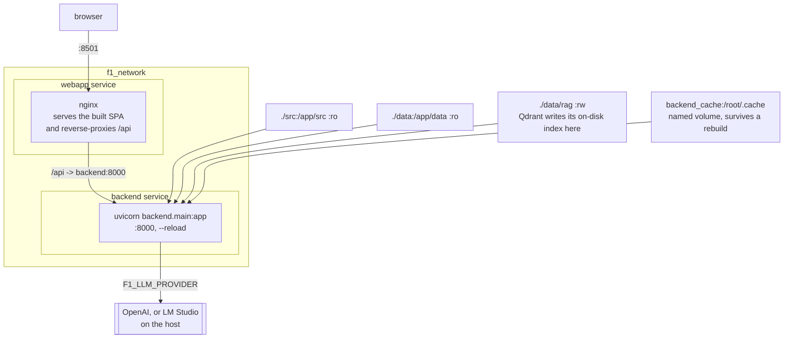

# Setup and Deployment

## Prerequisites

- Python 3.10+
- Node.js 18+ (for the React web app build / dev server)
- Docker and Docker Compose (for containerized deployment)
- LM Studio or OpenAI API key (for LLM-powered agents)

## Local development

### 1. Clone and install

```bash
git clone https://github.com/VforVitorio/F1-StratLab.git
cd F1-StratLab
git submodule update --init --recursive   # src/telemetry/ is a submodule
uv sync --all-extras
```

`uv` is the project's package manager (the lockfile `uv.lock` is committed and CI runs `uv sync --frozen`); a bare `pip install -e .` will not resolve the pinned, CUDA-routed PyTorch wheel the way `uv sync` does.

### 2. Data

The project requires pre-computed data artifacts. Download from HuggingFace:

```
https://huggingface.co/datasets/VforVitorio/f1-strategy-dataset
```

Place contents under `data/` at the repo root. Expected layout:

```
data/
  raw/2025/<GP>/laps.parquet
  processed/laps_featured_2025.parquet
  models/lap_time/                 -- N06 XGBoost
  models/tire_degradation/         -- N09/N10 TireDegTCN
  models/overtake_probability/     -- N12 LightGBM
  models/safety_car_probability/   -- N14 LightGBM
  models/pit_prediction/           -- N15 HistGBT + N16 undercut
  models/nlp/                      -- pipeline_config_v1.json
  models/agents/                   -- agent config JSONs
  rag/                             -- Qdrant index
  tire_compounds_by_race.json
```

### 3. Environment variables

Create a `.env` file at the repo root:

| Variable | Required | Default | Description |
|---|---|---|---|
| `BACKEND_URL` | no | `http://localhost:8000` | Backend URL, read by the frontend |
| `FRONTEND_URL` | no | `http://localhost:8501` | Frontend URL, read by the backend for CORS |
| `F1_LLM_PROVIDER` | no | `lmstudio` | Set to `openai` for OpenAI API |
| `OPENAI_API_KEY` | if provider=openai |, | OpenAI API key |
| `F1_STRAT_DATA_ROOT` | no | repo `data/` | Override data directory |
| `F1_API_KEY` | no | unset | Shared secret for the `X-API-Key` header. Unset = unauthenticated (safe only on a loopback bind, see `F1_HOST` below) |
| `F1_HOST` | no | `127.0.0.1` | The host uvicorn binds to. A non-loopback bind (e.g. `0.0.0.0`) with `F1_API_KEY` unset refuses to start |
| `F1_MCP_ENABLED` | no | `false` | Mount the external `/mcp` Streamable-HTTP endpoint. The chat pipeline uses the same tools in-process regardless |
| `F1_CHAT_MAX_TOKENS` | no | `2048` | Server-side cap on completion tokens per chat turn |
| `F1_RATE_LIMIT_OFF` | no | unset | Set to `1` to disable the per-route rate limiter (load tests only) |

See [Backend API reference → Authentication](#/backend-api) for how `F1_API_KEY` and `F1_HOST` interact.

### 4. Run the backend

```bash
cd src/telemetry
uvicorn backend.main:app --host 0.0.0.0 --port 8000 --reload
```

Verify at `http://localhost:8000/docs` (Swagger UI).

### 5. Run the web app

```bash
cd src/telemetry/webapp
npm install && npm run dev   # Vite dev server, proxies /api to :8000
```

Open `http://localhost:5173`. The production path serves the built SPA
through nginx on `:8501` (see Docker below), launched with `f1-webapp`.

### 6. LM Studio (for LLM agents)

Start LM Studio with a model loaded, serving on `http://localhost:1234/v1`. The orchestrator defaults to this endpoint. Sub-agents use `gpt-4.1-mini`; the orchestrator uses `gpt-5.4-mini`.

## Docker deployment



Two things are worth reading off that. **Qdrant is not a service:** it runs on-disk inside the backend process, which is why `data/rag` is the one mount that is read-write. And the browser only ever talks to `:8501`; `/api` is reverse-proxied, so there is no second origin and no CORS to configure.

`f1-webapp` wraps `docker compose up` on this file. `F1_STRAT_DATA_ROOT=/app/data` is what makes the container agree with a local checkout about where data lives.

Two equivalent compose files exist, one at the repo root and one path-relative copy inside the submodule, both already mount volumes for live code reload and data access, so pick whichever working directory is convenient.

### Root `docker-compose.yml`

```bash
docker-compose up --build
```

Services:

- **backend**: FastAPI on port 8000. Volumes: `./src:/app/src:ro` (read-only source, agents import from here), `./data:/app/data:ro` (read-only data), `./data/rag:/app/data/rag:rw` (writable RAG index, N30 may write here).
- **webapp**: React SPA served by nginx on port 8501; `/api` is reverse-proxied to `backend`, so the browser stays same-origin. Depends on `backend`.

`uv run f1-webapp` wraps this compose invocation and prints the URLs.

The `:ro` mounts mean agents must handle `OSError` / `PermissionError` gracefully when they attempt to create export directories inside the container.

### Telemetry `docker-compose.yml`

```bash
cd src/telemetry
docker-compose up --build
```

Same two services, with paths relative to `src/telemetry/` instead of the repo root. The cutover (#43) is done: the **webapp** owns `:8501` in both compose files and the Streamlit service is gone (the legacy Streamlit app was later removed from the repo entirely, #551).

### Webapp Dockerfile (multi-stage)

The webapp Dockerfile has two stages:

1. **node-builder**: `npm ci && npm run build` of the Vite + React SPA
2. **nginx**: serves the built assets and reverse-proxies `/api` to the backend service

### Backend Dockerfile

The backend Dockerfile installs `setuptools` and `wheel` first (needed by `openai-whisper` for `pkg_resources`), then installs all requirements with `--no-build-isolation`.

## Building the RAG index

Before using the RAG Agent (N30), build the Qdrant vector index:

```bash
python scripts/build_rag_index.py
```

This processes FIA Sporting Regulations PDFs and stores embeddings in `data/rag/`.

## Network architecture (Docker)

```
                    f1_network (bridge)
                    |                |
    webapp:8501  ---+                +-- backend:8000
    (nginx + SPA)   |                |   (FastAPI + uvicorn)
                    +-- LM Studio --+
                        :1234 (host)
```

The webapp's nginx reverse-proxies `/api` to `http://backend:8000` (Docker service name), so the browser stays same-origin. LM Studio runs on the host machine and is accessed at `http://host.docker.internal:1234/v1` or via host networking.
